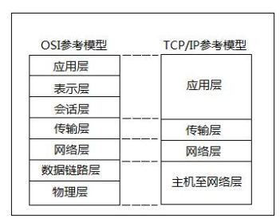

# OSI（Open System Interconnection 开放系统互连）参考模型

## 两种模型比照

   
  
  * 七层描述
    1. 物理层：主要定义物理设备标准，如网线的接口类型、光纤的接口类型、各种传输介质的传输速率
    等。它的主要作用是传输比特流（就是由1、0转化为电流强弱来进行传输，到达目的地后再转化为1、
    0，也就是我们常说的数模转换与模数转换）。这一层的数据叫做比特。
    2. 数据链路层：主要将从物理层接收的数据进行MAC地址（网卡的地址）的封装与解封装。常把这一
    层的数据叫做帧。在这一层工作的设备是交换机，数据通过交换机来传输。
    3. 网络层：主要将下层接收到的数据进行IP地址（例，192.168.0.1）的封装与解封装。在这一层工作
    的设备是路由器，常把这一层的数据叫做数据包。
    4. 传输层：定义了一些传输数据的协议和端口号（WWW端口号80等），如：TCP（传输控制协议，
    传输效率低，可靠性强，用于传输可靠性要求高，数据量大的数据），UDP（用户数据报协议，与TCP特
    性恰恰相反，用于传输可靠性要求不高，数据量小的数据，如QQ聊天数据就是通过这种方式传输的）。
    主要是将从下层接收的数据进行分段和传输，到达目的地址后再进行重组。常常把这一层叫做段。
    5. 会话层：通过传输层（端口号：传输端口与接收端口）建立数据传输的通路。主要在你的系统之间
    发起会话或者接收会话请求（设备之间需要互相认识可以是IP也可以是MAC或者是主机名）。
    6. 表示层：主要是进行对接收的数据进行解释，加密与解密、压缩与解压缩等（也就是把计算机能够
    识别的东西转换成人能够识别的东西（如图片、声音等）。
    7. 应用层：主要是一些终端的应用，比如说FTP（各种文件下载）、WEB（IE浏览）、QQ之类的（可
    以把它理解成我们在电脑屏幕上可以看到的东西，就是终端应用）。
    
  * 封包与解包示意图
  
 P.S.  
    1 每个网卡的MAC地址都是全球唯一的。  
    2 路由器实现将数据包发送到指定的地点。  
    3 应用软件之间通信的过程就是层与层之间封包、解封包的过程。(每一层都在识别自己能识别的特有的数据)  
    4 OSI参考模型虽然设计精细，但过于麻烦，效率不高，因此才产生了简化版的TCP/IP参考模型。

 
 