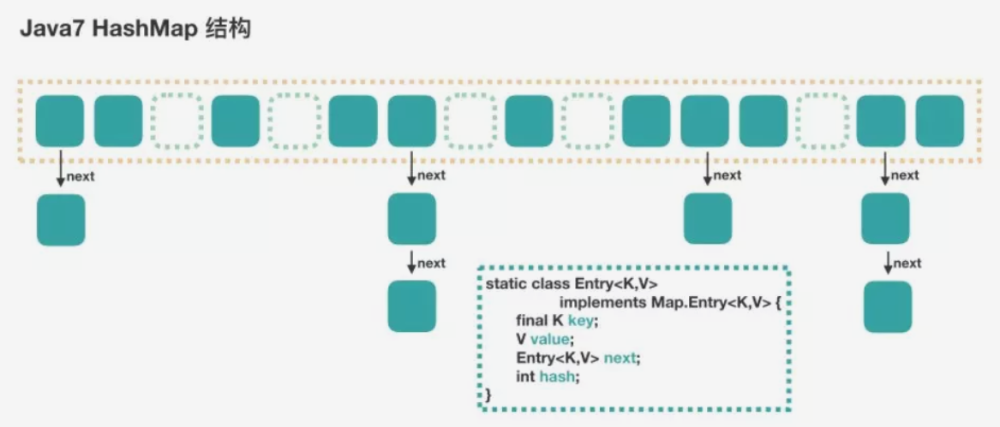

>来源：JavaDoop，
 javadoop.com/post/hashmap

>阅读前提：本文分析的是源码，所以至少读者要熟悉它们的接口使用，同时，对于并发，读者至少要知道 CAS、ReentrantLock、UNSAFE 操作这几个基本的知识，文中不会对这些知识进行介绍。Java8 用到了红黑树，不过本文不会进行展开，感兴趣的读者请自行查找相关资料。

Java7 HashMap

HashMap 是最简单的，一来我们非常熟悉，二来就是它不支持并发操作，所以源码也非常简单。

首先，我们用下面这张图来介绍 HashMap 的结构。


这个仅仅是示意图，因为没有考虑到数组要扩容的情况，具体的后面再说。

大方向上，HashMap 里面是一个数组，然后数组中每个元素是一个单向链表。

上图中，每个绿色的实体是嵌套类 Entry 的实例，Entry 包含四个属性：key, value, hash 值和用于单向链表的 next。

    capacity：当前数组容量，始终保持 2^n，可以扩容，扩容后数组大小为当前的 2 倍。

    loadFactor：负载因子，默认为 0.75。

    threshold：扩容的阈值，等于 capacity * loadFactor

put 过程分析
---
还是比较简单的，跟着代码走一遍吧。
```
public V put(K key, V value) {
    // 当插入第一个元素的时候，需要先初始化数组大小
    if (table == EMPTY_TABLE) {
        inflateTable(threshold);
    }
    // 如果 key 为 null，感兴趣的可以往里看，最终会将这个 entry 放到 table[0] 中
    if (key == null)
        return putForNullKey(value);
    // 1. 求 key 的 hash 值
    int hash = hash(key);
    // 2. 找到对应的数组下标
    int i = indexFor(hash, table.length);
    // 3. 遍历一下对应下标处的链表，看是否有重复的 key 已经存在，
    //    如果有，直接覆盖，put 方法返回旧值就结束了
    for (Entry<K,V> e = table[i]; e != null; e = e.next) {
        Object k;
        if (e.hash == hash && ((k = e.key) == key || key.equals(k))) {
            V oldValue = e.value;
            e.value = value;
            e.recordAccess(this);
            return oldValue;
        }
    }
 
    modCount++;
    // 4. 不存在重复的 key，将此 entry 添加到链表中，细节后面说
    addEntry(hash, key, value, i);
    return null;
}
```

数组初始化
---

在第一个元素插入 HashMap 的时候做一次数组的初始化，就是先确定初始的数组大小，并计算数组扩容的阈值。

```
private void inflateTable(int toSize) {
    // 保证数组大小一定是 2 的 n 次方。
    // 比如这样初始化：new HashMap(20)，那么处理成初始数组大小是 32
    int capacity = roundUpToPowerOf2(toSize);
    // 计算扩容阈值：capacity * loadFactor
    threshold = (int) Math.min(capacity * loadFactor, MAXIMUM_CAPACITY + 1);
    // 算是初始化数组吧
    table = new Entry[capacity];
    initHashSeedAsNeeded(capacity); //ignore
}
```

这里有一个将数组大小保持为 2 的 n 次方的做法，Java7 和 Java8 的 HashMap 和 ConcurrentHashMap 都有相应的要求，只不过实现的代码稍微有些不同，后面再看到的时候就知道了。

计算具体数组位置
---
这个简单，我们自己也能猜想一个：使用 key 的 hash 值对数组长度进行取模就可以了。
```
static int indexFor(int hash, int length) {
    // assert Integer.bitCount(length) == 1 : "length must be a non-zero power of 2";
    return hash & (length-1);
}
```
这个方法很简单，简单说就是取 hash 值的低 n 位。如在数组长度为 32 的时候，其实取的就是 key 的 hash 值的低 5 位，作为它在数组中的下标位置。

添加节点到链表中
---
找到数组下标后，会先进行 key 判重，如果没有重复，就准备将新值放入到链表的表头。
```
void addEntry(int hash, K key, V value, int bucketIndex) {
    // 如果当前 HashMap 大小已经达到了阈值，并且新值要插入的数组位置已经有元素了，那么要扩容
    if ((size >= threshold) && (null != table[bucketIndex])) {
        // 扩容，后面会介绍一下
        resize(2 * table.length);
        // 扩容以后，重新计算 hash 值
        hash = (null != key) ? hash(key) : 0;
        // 重新计算扩容后的新的下标
        bucketIndex = indexFor(hash, table.length);
    }
    // 往下看
    createEntry(hash, key, value, bucketIndex);
}
// 这个很简单，其实就是将新值放到链表的表头，然后 size++
void createEntry(int hash, K key, V value, int bucketIndex) {
    Entry<K,V> e = table[bucketIndex];
    table[bucketIndex] = new Entry<>(hash, key, value, e);
    size++;
}
```
这个方法的主要逻辑就是先判断是否需要扩容，需要的话先扩容，然后再将这个新的数据插入到扩容后的数组的相应位置处的链表的表头。

数组扩容
---
前面我们看到，在插入新值的时候，如果当前的 size 已经达到了阈值，并且要插入的数组位置上已经有元素，那么就会触发扩容，扩容后，数组大小为原来的 2 倍。
```
void resize(int newCapacity) {
    Entry[] oldTable = table;
    int oldCapacity = oldTable.length;
    if (oldCapacity == MAXIMUM_CAPACITY) {
        threshold = Integer.MAX_VALUE;
        return;
    }
    // 新的数组
    Entry[] newTable = new Entry[newCapacity];
    // 将原来数组中的值迁移到新的更大的数组中
    transfer(newTable, initHashSeedAsNeeded(newCapacity));
    table = newTable;
    threshold = (int)Math.min(newCapacity * loadFactor, MAXIMUM_CAPACITY + 1);
}
```
扩容就是用一个新的大数组替换原来的小数组，并将原来数组中的值迁移到新的数组中。

由于是双倍扩容，迁移过程中，会将原来 table[i] 中的链表的所有节点，分拆到新的数组的 newTable[i] 和 newTable[i + oldLength] 位置上。如原来数组长度是 16，那么扩容后，原来 table[0] 处的链表中的所有元素会被分配到新数组中 newTable[0] 和 newTable[16] 这两个位置。代码比较简单，这里就不展开了。

get 过程分析
---
相对于 put 过程，get 过程是非常简单的。

1. 根据 key 计算 hash 值。
2. 找到相应的数组下标：hash & (length – 1)。
3. 遍历该数组位置处的链表，直到找到相等(==或equals)的 key。

```
public V get(Object key) {
    // 之前说过，key 为 null 的话，会被放到 table[0]，所以只要遍历下 table[0] 处的链表就可以了
    if (key == null)
        return getForNullKey();
    // 
    Entry<K,V> entry = getEntry(key);
 
    return null == entry ? null : entry.getValue();
}

getEntry(key):

final Entry<K,V> getEntry(Object key) {
    if (size == 0) {
        return null;
    }
 
    int hash = (key == null) ? 0 : hash(key);
    // 确定数组下标，然后从头开始遍历链表，直到找到为止
    for (Entry<K,V> e = table[indexFor(hash, table.length)];
         e != null;
         e = e.next) {
        Object k;
        if (e.hash == hash &&
            ((k = e.key) == key || (key != null && key.equals(k))))
            return e;
    }
    return null;
}
```